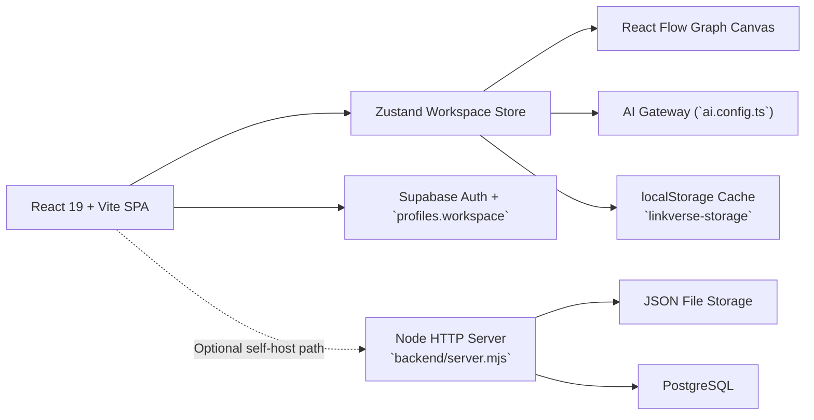

<a id="top"></a>

<div align="center">
  <h1>LinkVerse</h1>

  <p><strong>Relationship-first workspace for notes, graphs, and product thinking.</strong></p>

  <p>
    
    
    
    
    
    
  </p>

  <p>
    <a href="#english">English</a> |
    <a href="#chinese">简体中文</a>
  </p>
</div>

---

<a id="english"></a>

## English

LinkVerse turns scattered notes, saved links, and product ideas into a navigable visual system. It combines graph editing, note-taking, resource capture, and AI-assisted context building inside one workspace.

### Highlights

- Visual graph workspace powered by React Flow for root-category-petal style thinking.
- Unified project model for graphs, notes, and resource cards.
- Supabase-based auth and cloud sync with browser-side local persistence.
- Provider-neutral AI surface with runtime model configuration and per-account key override.
- Optional self-hosted backend path with Node.js plus PostgreSQL or JSON file storage.

### Architecture



The current production-oriented path is front-end first: the app authenticates and syncs workspace snapshots directly through Supabase. The repository also includes an optional Node HTTP backend for self-hosted deployments.

### Quick Start

#### 1. Install

```bash
npm install
```

#### 2. Configure

```bash
cp .env.example .env.local
```

Required for the primary cloud flow:

- `VITE_SUPABASE_URL`
- `VITE_SUPABASE_ANON_KEY`

Optional AI settings:

- `VITE_AI_API_KEY`
- `VITE_AI_MODEL`

Optional self-hosted backend settings:

- `DATABASE_URL`
- `PORT`

#### 3. Run

```bash
npm run dev
```

This starts both the Vite front end and the Node backend helper.

- Frontend: [http://localhost:5173](http://localhost:5173)
- Backend health check: [http://localhost:8787/api/health](http://localhost:8787/api/health)

### Tech Stack

- `React 19`
- `TypeScript`
- `Vite`
- `React Flow`
- `Zustand`
- `Supabase`
- AI model SDK adapter through a neutral config layer
- Optional `Node.js` + `PostgreSQL` / JSON storage

### Project Structure

- [`App.tsx`](./App.tsx): application shell, auth flow, workspace lifecycle, settings UI
- [`store/useStore.ts`](./store/useStore.ts): state store, graph logic, AI orchestration, local persistence
- [`auth.ts`](./auth.ts): Supabase auth and workspace sync
- [`ai.config.ts`](./ai.config.ts): runtime AI configuration resolution
- [`backend/server.mjs`](./backend/server.mjs): optional Node HTTP backend
- [`backend/db.mjs`](./backend/db.mjs): file/Postgres persistence adapter
- [`supabase/schema.sql`](./supabase/schema.sql): schema bootstrap and RLS policies
- [`TECHNICAL_IMPLEMENTATION.md`](./TECHNICAL_IMPLEMENTATION.md): full implementation document

### Deployment Notes

- Netlify works well for the current front-end plus Supabase path.
- Render remains a good fit if you want to serve the optional Node backend as well.
- For Netlify builds, use `npm run build` and publish `dist`.

### Documentation

- [Technical Implementation](./TECHNICAL_IMPLEMENTATION.md)
- [Supabase Schema](./supabase/schema.sql)

[Back to top](#top)

---

<a id="chinese"></a>

## 简体中文

LinkVerse 是一个以关系为核心的知识工作区，把零散笔记、收藏链接和产品想法组织成可浏览、可推演、可扩展的视觉系统。它把图谱编辑、笔记整理、资源收集和 AI 辅助理解放进同一个工作区里。

### 核心特性

- 基于 React Flow 的可视化图谱工作区，适合根节点、分类节点、分支节点式思考。
- 统一项目模型，同时支持图谱、笔记和资源卡片。
- 通过 Supabase 实现鉴权与云同步，并保留浏览器本地持久化作为兜底。
- AI 接入层保持中性表达，支持运行时模型配置和账号级 API Key 覆盖。
- 保留可选的自托管后端路径，可使用 Node.js 搭配 PostgreSQL 或 JSON 文件存储。

### 架构概览


当前更贴近生产使用的主路径是前端直连 Supabase：应用直接通过 Supabase 完成用户鉴权和工作区快照同步。仓库中同时保留了一套可选的 Node HTTP 后端，便于后续自托管部署。

### 快速开始

#### 1. 安装依赖

```bash
npm install
```

#### 2. 配置环境变量

```bash
cp .env.example .env.local
```

主云端路径必填：

- `VITE_SUPABASE_URL`
- `VITE_SUPABASE_ANON_KEY`

可选 AI 配置：

- `VITE_AI_API_KEY`
- `VITE_AI_MODEL`

可选自托管后端配置：

- `DATABASE_URL`
- `PORT`

#### 3. 启动项目

```bash
npm run dev
```

该命令会同时启动 Vite 前端和 Node 后端辅助服务。

- 前端地址：[http://localhost:5173](http://localhost:5173)
- 后端健康检查：[http://localhost:8787/api/health](http://localhost:8787/api/health)

### 技术栈

- `React 19`
- `TypeScript`
- `Vite`
- `React Flow`
- `Zustand`
- `Supabase`
- 通过中性配置层接入底层 AI 模型 SDK
- 可选 `Node.js` + `PostgreSQL` / JSON 存储

### 项目结构

- [`App.tsx`](./App.tsx)：应用壳层、鉴权流程、工作区生命周期、设置界面
- [`store/useStore.ts`](./store/useStore.ts)：状态管理、图谱逻辑、AI 编排、本地持久化
- [`auth.ts`](./auth.ts)：Supabase 鉴权与工作区同步
- [`ai.config.ts`](./ai.config.ts)：运行时 AI 配置解析
- [`backend/server.mjs`](./backend/server.mjs)：可选 Node HTTP 后端
- [`backend/db.mjs`](./backend/db.mjs)：文件/Postgres 持久化适配层
- [`supabase/schema.sql`](./supabase/schema.sql)：数据库初始化与 RLS 策略
- [`TECHNICAL_IMPLEMENTATION.md`](./TECHNICAL_IMPLEMENTATION.md)：完整技术实现文档

### 部署说明

- 当前前端加 Supabase 的主路径非常适合部署到 Netlify。
- 如果需要同时启用可选的 Node 后端，Render 会更合适。
- Netlify 构建建议使用 `npm run build`，发布目录为 `dist`。

### 文档

- [技术实现文档](./TECHNICAL_IMPLEMENTATION.md)
- [Supabase 数据结构](./supabase/schema.sql)

[返回顶部](#top)
