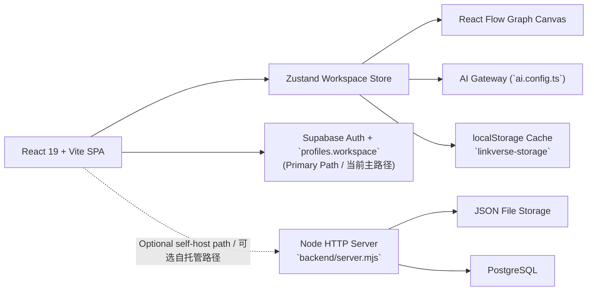

<div align="center">
  

  <h1>LinkVerse</h1>

  <p>
    <strong>Relationship-first workspace for notes, graphs, and product thinking.</strong><br/>
    <strong>以关系为核心的视觉化工作区，把笔记、图谱与产品思考放进同一张画布。</strong>
  </p>

  <p>
    
    
    
    
    
    
  </p>
</div>

> LinkVerse turns scattered notes, saved links, and product ideas into a navigable visual system.  
> LinkVerse 把零散笔记、收藏链接与产品想法整理成一套可浏览、可推演、可延展的视觉系统。

## Why It Feels Different / 为什么它不只是另一个笔记工具

- **Notes, graphs, and references live together.** A project can be a graph, a note, or a resource, but all of them stay connected inside one workspace. / **笔记、图谱、资料共处一体。** 项目既可以是图谱、笔记，也可以是资源卡片，但它们始终保留在同一个工作区上下文里。
- **Structure is visible, not hidden.** Instead of burying meaning in folders, LinkVerse surfaces relationships through nodes, branches, tags, and cross-links. / **结构可见，而不是藏在文件夹里。** LinkVerse 通过节点、分支、标签与交叉连接把关系直接展示出来。
- **AI helps shape context, not just generate text.** The assistant can read the active project, explain graph meaning, expand branches, and generate graph structures from tagged knowledge. / **AI 帮你组织上下文，而不只是补全文字。** 助手可以读取当前项目、解释图谱结构、扩展分支，并从标签化知识中生成图谱。

## Core Experience / 核心体验

- **Visual graph workspace** powered by React Flow for root-category-petal style thinking. / **可视化图谱工作区**，基于 React Flow，适合根节点-分类-分支式思考。
- **Dual project model** for graph, note, and resource items in one unified data structure. / **统一项目模型**，图谱、笔记、资源三种形态共用一套数据结构。
- **Cloud sync with local resilience** through Supabase-backed workspace snapshots plus browser persistence. / **云端同步与本地兜底并存**，通过 Supabase 工作区快照和浏览器持久化共同保障数据连续性。
- **Provider-neutral AI surface** with runtime model configuration and per-account API key override. / **中性的 AI 接入层**，支持运行时模型配置与账号级 API Key 覆盖。
- **Optional self-hosted backend path** for teams that want a Node server with file or Postgres storage. / **可选自托管后端路径**，适合需要 Node 服务与文件或 Postgres 存储的团队。

## Architecture / 架构概览



LinkVerse currently ships with two persistence paths in the codebase: the active front-end path uses Supabase directly, while the repository also includes an optional Node server for self-hosted deployments.  
LinkVerse 当前在代码库里同时保留两条持久化路径：前端主路径直接连接 Supabase，仓库也附带一套可选的 Node 自托管服务。

## Quick Start / 快速开始

### 1. Install / 安装依赖

```bash
npm install
```

### 2. Configure / 配置环境变量

```bash
cp .env.example .env.local
```

Required for the current primary cloud flow: `VITE_SUPABASE_URL`, `VITE_SUPABASE_ANON_KEY`  
当前主云端路径必填：`VITE_SUPABASE_URL`、`VITE_SUPABASE_ANON_KEY`

Optional AI settings: `VITE_AI_API_KEY`, `VITE_AI_MODEL`  
可选 AI 配置：`VITE_AI_API_KEY`、`VITE_AI_MODEL`

Optional self-hosted backend settings: `DATABASE_URL`, `PORT`  
可选自托管后端配置：`DATABASE_URL`、`PORT`

### 3. Run / 启动项目

```bash
npm run dev
```

This starts both the Vite front end and the Node backend helper.  
这会同时启动 Vite 前端和 Node 后端辅助服务。

Frontend: [http://localhost:5173](http://localhost:5173)  
前端地址：[http://localhost:5173](http://localhost:5173)

Backend health check: [http://localhost:8787/api/health](http://localhost:8787/api/health)  
后端健康检查：[http://localhost:8787/api/health](http://localhost:8787/api/health)

## Tech Stack / 技术栈

- `React 19` + `TypeScript` + `Vite`
- `React Flow` for graph rendering / 用于图谱渲染
- `Zustand` for workspace state / 用于工作区状态管理
- `Supabase` for auth and cloud sync / 用于鉴权与云同步
- provider SDK adapter behind a neutral AI config layer / 通过中性的 AI 配置层接入底层模型 SDK
- Optional `Node.js` + `PostgreSQL` or JSON file storage / 可选 `Node.js` + `PostgreSQL` 或 JSON 文件存储

## Project Structure / 项目结构

- [`App.tsx`](./App.tsx): main application shell, auth flow, workspace lifecycle, settings UI / 主应用壳层、鉴权流程、工作区生命周期、设置界面
- [`store/useStore.ts`](./store/useStore.ts): core state store, graph logic, AI orchestration, local persistence / 核心状态仓库、图谱逻辑、AI 编排、本地持久化
- [`auth.ts`](./auth.ts): Supabase auth and profile/workspace sync / Supabase 鉴权与 profile/workspace 同步
- [`ai.config.ts`](./ai.config.ts): runtime AI configuration resolution / 运行时 AI 配置解析
- [`backend/server.mjs`](./backend/server.mjs): optional Node HTTP backend / 可选 Node HTTP 后端
- [`backend/db.mjs`](./backend/db.mjs): file/Postgres persistence adapter / 文件与 Postgres 持久化适配层
- [`supabase/schema.sql`](./supabase/schema.sql): database bootstrap and RLS policies / 数据库初始化与 RLS 策略
- [`TECHNICAL_IMPLEMENTATION.md`](./TECHNICAL_IMPLEMENTATION.md): full bilingual implementation document / 完整双语技术实现文档

## Deployment Notes / 部署说明

- **Supabase-first deployment**: easiest path for the current app because auth and workspace sync already run directly from the browser. / **Supabase 优先部署**：最适合当前应用，因为鉴权与工作区同步已经可以直接从浏览器完成。
- **Render self-hosted path**: [`render.yaml`](./render.yaml) builds the app and serves it through the Node backend. / **Render 自托管路径**：[`render.yaml`](./render.yaml) 会构建应用并通过 Node 后端统一提供服务。
- **AI runtime**: surface branding stays neutral in the UI, while the underlying model remains configurable. / **AI 运行时**：界面层保持中性文案，底层模型仍然可配置。

## Documentation / 文档

- [Technical Implementation / 技术实现文档](./TECHNICAL_IMPLEMENTATION.md)
- [Supabase Schema / Supabase 数据结构](./supabase/schema.sql)

<div align="center">
  <sub>Designed for connected thinking, not isolated files. / 为连接式思考而生，而不是为孤立文件而生。</sub>
</div>
