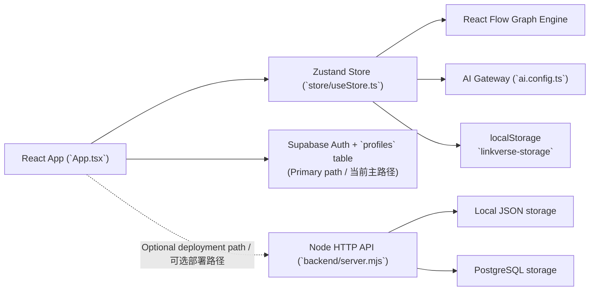

# Technical Implementation / 技术实现文档

This document is based on the current repository implementation and explains how LinkVerse works across the front end, data layer, AI layer, and optional backend path.  
本文档基于当前仓库代码编写，说明 LinkVerse 在前端、数据层、AI 层以及可选后端路径上的实际实现方式。

## 1. Product Positioning / 产品定位

LinkVerse is a relationship-first workspace. Instead of treating notes, references, and graphs as separate modules, it models them as one shared project system with different visual modes.  
LinkVerse 是一个以关系为核心的工作区。它并不把笔记、资料和图谱拆成彼此割裂的模块，而是把它们统一建模为同一套项目系统中的不同呈现方式。

The core product idea is simple: capture information once, then reuse it across note editing, graph exploration, database tags, and AI-assisted reasoning.  
核心产品思路很直接：信息只录入一次，之后可以在笔记编辑、图谱浏览、数据库标签和 AI 辅助推理之间反复复用。

## 2. Current Architecture / 当前架构

### Architectural Truth / 架构事实

- **Primary active path / 当前主路径:** the front end authenticates and syncs workspace data directly through Supabase client APIs in [`auth.ts`](./auth.ts) and [`supabase.ts`](./supabase.ts).  
  **当前主路径：** 前端通过 [`auth.ts`](./auth.ts) 和 [`supabase.ts`](./supabase.ts) 直接调用 Supabase 客户端 API 完成鉴权与工作区同步。
- **Optional server path / 可选服务端路径:** the repository also contains a native Node HTTP server in [`backend/server.mjs`](./backend/server.mjs) with file/Postgres persistence in [`backend/db.mjs`](./backend/db.mjs).  
  **可选服务端路径：** 仓库同时包含一套基于原生 Node HTTP 的服务端实现 [`backend/server.mjs`](./backend/server.mjs)，并由 [`backend/db.mjs`](./backend/db.mjs) 提供文件/Postgres 持久化。
- **Important note / 重要说明:** the current front-end code does not call `/api/*` during the main product flow; that Node server is best understood as an alternate deployment mode or migration base.  
  **重要说明：** 当前前端主流程并不会直接调用 `/api/*`；这套 Node 服务更适合作为替代部署模式或后续迁移底座来理解。

## 3. Front-End Implementation / 前端实现

### 3.1 Application Shell / 应用壳层

- The app is a `React 19 + TypeScript + Vite` single-page application. The root is mounted in [`index.tsx`](./index.tsx), which also suppresses noisy `ResizeObserver` errors commonly triggered by graph layout changes.  
  应用是一个基于 `React 19 + TypeScript + Vite` 的单页应用。根入口在 [`index.tsx`](./index.tsx)，同时对图谱布局常见的 `ResizeObserver` 噪声报错做了抑制处理。
- [`App.tsx`](./App.tsx) acts as the UI orchestrator. It holds the auth screen, dashboard, editor, friends/team views, settings, workspace hydration, auto-save timing, and theme synchronization.  
  [`App.tsx`](./App.tsx) 是 UI 编排中心，负责鉴权界面、仪表盘、编辑器、好友/团队视图、设置页、工作区拉取、自动保存节流以及主题同步。

### 3.2 Core Data Model / 核心数据模型

The shared project schema lives in [`types.ts`](./types.ts). A `Project` can be one of three types:  
共享项目模型定义在 [`types.ts`](./types.ts)。一个 `Project` 可以是三种类型之一：

- `graph`: stores `nodes`, `edges`, and graph-specific chat threads / 存储 `nodes`、`edges` 与图谱相关对话
- `note`: stores long-form text content / 存储长文本内容
- `resource`: stores `url` and `summary` / 存储链接与摘要

This polymorphic model is important because it lets the workspace mix notes, visual graphs, and saved references without separate storage systems.  
这种多态项目模型很关键，因为它让工作区能够在不拆分存储系统的前提下，同时容纳笔记、可视图谱和外部资料。

### 3.3 State Management / 状态管理

The core store is implemented in [`store/useStore.ts`](./store/useStore.ts) using `Zustand` plus `persist`.  
核心状态仓库位于 [`store/useStore.ts`](./store/useStore.ts)，使用 `Zustand` 和 `persist` 实现。

Main responsibilities include:  
它的主要职责包括：

- global UI state such as active view, selected project, theme, sidebar state, and editing panels / 全局 UI 状态，如当前视图、选中项目、主题、侧边栏状态和编辑面板
- workspace data such as projects, tags, nodes, edges, chat threads, and direct messages / 工作区数据，如项目、标签、节点、连线、对话线程和私信
- graph editing actions such as node add/delete, edge connect/delete, label updates, and layout switching / 图谱编辑动作，如节点增删、连线增删、标签更新和布局切换
- AI orchestration for graph generation, branch expansion, graph sync, and workspace copilot / AI 编排，包括图谱生成、分支扩展、图谱同步和工作区 Copilot

### 3.4 Workspace Snapshot Strategy / 工作区快照策略

The workspace snapshot format is defined in [`workspace.types.ts`](./workspace.types.ts) and contains only three top-level fields:  
工作区快照格式定义在 [`workspace.types.ts`](./workspace.types.ts)，顶层只包含三个字段：

- `projects`
- `availableTags`
- `theme`

[`store/useStore.ts`](./store/useStore.ts) provides three key helpers:  
[`store/useStore.ts`](./store/useStore.ts) 提供了三个关键辅助函数：

- `createDefaultWorkspaceSnapshot()`: seeds the workspace with starter demo content / 用启动示例内容初始化工作区
- `normalizeWorkspaceSnapshot()`: guarantees shape safety and merges starter content / 保证结构安全并合并启动内容
- `getWorkspaceSnapshotFromState()`: extracts the persistable subset from the live store / 从运行中的 store 里提取可持久化子集

Only `projects`, `availableTags`, and `theme` are persisted to `localStorage` under `linkverse-storage`. View-specific state like active screen or selected project is intentionally not persisted, so every fresh session returns to a clean dashboard state.  
只有 `projects`、`availableTags` 和 `theme` 会以 `linkverse-storage` 的 key 持久化到 `localStorage`。像当前页面、当前打开项目这样的临时视图状态不会持久化，这样每次新会话都能回到干净的 dashboard 起点。

### 3.5 Graph Rendering / 图谱渲染

- LinkVerse uses `React Flow` as the graph engine.  
  LinkVerse 使用 `React Flow` 作为图谱引擎。
- Custom node rendering is implemented in [`components/MindNode.tsx`](./components/MindNode.tsx).  
  自定义节点渲染在 [`components/MindNode.tsx`](./components/MindNode.tsx) 中实现。
- Graph lines default to clean, straight zinc-colored edges, matching the app's minimal visual language.  
  图谱连线默认使用简洁的灰色直线，以匹配应用整体克制的视觉语言。
- Each project stores its own `viewState` with `x`, `y`, `zoom`, and minimap visibility so that graph navigation can be resumed.  
  每个项目都保存独立的 `viewState`，包括 `x`、`y`、`zoom` 和 minimap 开关，从而恢复上次图谱浏览位置。

### 3.6 Authentication and Workspace Hydration / 鉴权与工作区恢复

The session bootstrap flow is coordinated in [`App.tsx`](./App.tsx):  
会话启动流程主要由 [`App.tsx`](./App.tsx) 协调：

1. `hydrateCurrentUser()` restores the active user session. / `hydrateCurrentUser()` 恢复当前用户会话。  
2. `hydrateAuthMeta()` checks whether accounts already exist. / `hydrateAuthMeta()` 检查是否已存在账户。  
3. If a user is present, `fetchWorkspaceSnapshot()` loads the remote workspace from Supabase. / 如果用户已登录，`fetchWorkspaceSnapshot()` 会从 Supabase 拉取远端工作区。  
4. If no remote workspace exists, the app decides between the last local workspace for the same owner or a new starter workspace, then seeds the cloud copy. / 如果远端还没有工作区，应用会在“同一用户的本地工作区”和“新的默认工作区”之间做选择，并把结果回写到云端。

This gives the app a useful hybrid behavior: cloud-first when available, local-preserving when cloud sync is temporarily unavailable.  
这让应用具备一种实用的混合特性：云端优先，但在云同步暂时失效时仍然保留本地连续性。

### 3.7 Auto-Save / 自动保存

Once the workspace is ready and a user is authenticated, [`App.tsx`](./App.tsx) watches the serialized workspace signature and sends a debounced save through `saveWorkspaceSnapshot()` after 900ms.  
当工作区准备完毕且用户已登录后，[`App.tsx`](./App.tsx) 会监听序列化后的工作区签名，并在 900ms 防抖后通过 `saveWorkspaceSnapshot()` 自动保存。

This means:  
这意味着：

- edits are not saved on every keystroke request / 编辑不会在每次输入时都发起保存请求
- cloud sync is near-real-time for normal usage / 对正常使用来说云同步接近实时
- if cloud save fails, the browser copy still remains in local persistence / 如果云保存失败，浏览器端的本地持久化仍然存在

## 4. AI Implementation / AI 实现

### 4.1 AI Configuration Layer / AI 配置层

[`ai.config.ts`](./ai.config.ts) is the runtime resolver for model configuration.  
[`ai.config.ts`](./ai.config.ts) 是运行时模型配置解析层。

Resolution order:  
解析优先级如下：

1. per-account stored override / 账号级已保存配置  
2. environment variables / 环境变量  
3. placeholder fallback / 占位回退值

The surface UI intentionally uses provider-neutral language, while the current implementation still routes through a provider SDK adapter and defaults to `gemini-2.5-flash`.  
界面层刻意使用中性的 AI 文案，而当前实现底层仍通过模型 SDK 适配层调用，并默认使用 `gemini-2.5-flash`。

### 4.2 Copilot Chat / Copilot 对话

`sendAgentMessage()` in [`store/useStore.ts`](./store/useStore.ts) is the main copilot entry point.  
[`store/useStore.ts`](./store/useStore.ts) 中的 `sendAgentMessage()` 是主 Copilot 入口。

Its workflow is:  
它的执行流程是：

1. append the user message to the active copilot thread / 把用户消息写入当前 Copilot 线程  
2. assemble context from the active project, note content, graph structure, and related knowledge / 从当前项目、笔记内容、图谱结构与关联知识中拼装上下文  
3. decide whether graph-edit tools should be exposed based on the prompt intent / 根据用户意图决定是否暴露图谱编辑工具  
4. call the model with prompt + optional function declarations / 带着提示词和可选函数声明调用模型  
5. apply returned tool calls locally, then append the model reply / 本地执行返回的工具调用，再写入模型回复

Supported tool calls include:  
支持的工具调用包括：

- `addNode`
- `connectNodes`
- `changeLayout`
- `syncGraph`

There is also fallback behavior for explanation-style questions and unsupported edit requests, so the copilot can still respond usefully even when no tool should run.  
对于“解释图谱含义”这类问题，以及当前不支持的编辑请求，系统还提供了回退逻辑，因此即使不触发任何工具，Copilot 仍能给出有帮助的响应。

### 4.3 Graph Generation / 图谱生成

`generateGraphFromDatabases(selectedTags)` creates a new graph project from tagged workspace content.  
`generateGraphFromDatabases(selectedTags)` 会根据所选标签对应的工作区内容生成新的图谱项目。

Implementation details:  
实现细节如下：

- it gathers all projects matching the selected database tags / 收集命中所选数据库标签的所有项目
- it sends the combined context to the model with strict JSON output instructions / 将合并后的上下文提交给模型，并强制要求输出 JSON
- it maps AI output into a radial layout with one root, multiple categories, and petal nodes / 把 AI 输出映射成径向布局：一个根节点、多个分类节点和若干 petal 节点
- it preserves cross-links as extra edges to represent lateral connections / 把跨分支联系保留为额外连线，体现横向关联
- it stores the result as a new `graph` project tagged with `Graphs` and the selected sources / 最终保存为新的 `graph` 项目，并自动附加 `Graphs` 与所选来源标签

### 4.4 Branch Expansion / 分支扩展

`triggerAIAnalysis(parentNodeId)` asks the model to generate 3 to 4 related concepts around an existing node.  
`triggerAIAnalysis(parentNodeId)` 会围绕现有节点请求模型生成 3 到 4 个相关概念。

The new nodes are placed in a radial spread around the parent node and inherit a simplified palette strategy to keep the graph readable.  
新节点会沿父节点周围呈放射状展开，并遵循简化的调色策略，以保持图谱可读性。

### 4.5 Conservative Graph Sync / 保守式图谱同步

`syncGraph(projectId)` compares a graph project against other projects sharing the same tags.  
`syncGraph(projectId)` 会把当前图谱项目与其他共享相同标签的项目进行比对。

The prompt instructs the model to:  
提示词会要求模型：

- keep existing structure as much as possible / 尽可能保留现有结构
- suggest additions for missing concepts / 为缺失概念提出新增节点
- suggest removals only when confidence is high / 仅在把握较高时建议删除节点
- attach new nodes near relevant existing parents / 把新增节点挂到合适的既有父节点附近

This is a good example of LinkVerse using AI as an augmentation layer rather than a full layout rewrite engine.  
这很好地体现了 LinkVerse 如何把 AI 用作增强层，而不是完全接管布局的重绘引擎。

## 5. Back-End and Data Layer / 后端与数据层

### 5.1 Primary Cloud Path: Supabase / 主云端路径：Supabase

[`supabase.ts`](./supabase.ts) initializes a browser-side Supabase client using:  
[`supabase.ts`](./supabase.ts) 使用以下环境变量初始化浏览器侧 Supabase 客户端：

- `VITE_SUPABASE_URL`
- `VITE_SUPABASE_ANON_KEY`

[`auth.ts`](./auth.ts) then implements:  
[`auth.ts`](./auth.ts) 进一步实现了：

- sign up / sign in / sign out / 注册、登录、登出
- session hydration / 会话恢复
- profile update / 个人资料更新
- per-user AI settings update / 用户级 AI 设置更新
- workspace snapshot fetch and save / 工作区快照拉取与保存

### 5.2 Supabase Schema / Supabase 数据结构

[`supabase/schema.sql`](./supabase/schema.sql) defines a single `public.profiles` table extending `auth.users`.  
[`supabase/schema.sql`](./supabase/schema.sql) 定义了一张 `public.profiles` 表，用来扩展 `auth.users`。

Key fields include:  
关键字段包括：

- identity and profile data: `id`, `email`, `display_name`, `role`, `plan` / 身份与资料字段
- AI settings: `api_key`, `ai_model` / AI 设置字段
- workspace payload: `workspace jsonb` / 工作区快照字段 `workspace jsonb`
- timestamps: `created_at`, `updated_at` / 时间字段

The schema also includes:  
该 schema 还包含：

- an `updated_at` trigger / 自动更新时间戳触发器
- a `handle_new_user()` function to seed profile rows / 自动为新用户生成 profile 的函数
- row-level security policies that restrict read/write access to the current user's own row / 只允许当前用户访问自己 profile 的 RLS 策略

This is a deliberately compact data model: one row per user stores both profile metadata and the full serialized workspace.  
这是一种刻意保持紧凑的数据模型：每个用户只用一行就同时保存个人资料和整个序列化工作区。

### 5.3 Optional Node Backend / 可选 Node 后端

[`backend/server.mjs`](./backend/server.mjs) is a zero-framework HTTP server built on `node:http`.  
[`backend/server.mjs`](./backend/server.mjs) 是一套基于 `node:http` 的零框架 HTTP 服务。

Implemented routes include:  
它实现了以下路由：

- `GET /api/health`
- `GET /api/auth/meta`
- `POST /api/auth/register`
- `POST /api/auth/login`
- `POST /api/auth/logout`
- `GET /api/auth/me`
- `PATCH /api/auth/profile`
- `PATCH /api/auth/ai-settings`
- `DELETE /api/auth/ai-settings`
- `GET /api/workspace`
- `PUT /api/workspace`

Authentication is token-based and uses `scryptSync` password hashing with per-user salt.  
鉴权采用令牌机制，密码通过带盐的 `scryptSync` 进行哈希。

[`backend/db.mjs`](./backend/db.mjs) abstracts persistence with two modes:  
[`backend/db.mjs`](./backend/db.mjs) 用两种模式抽象持久化：

- `file` mode when `DATABASE_URL` is absent, writing to `backend/data/auth-db.json` / 缺少 `DATABASE_URL` 时写入 `backend/data/auth-db.json`
- `postgres` mode when `DATABASE_URL` exists / 存在 `DATABASE_URL` 时切换到 `postgres` 模式

This backend can serve the built frontend and expose a complete workspace API, which makes it a viable self-hosted path even though the current browser flow is Supabase-first.  
这套后端既能提供打包后的前端静态资源，也能暴露完整工作区 API，因此即便当前浏览器主路径是 Supabase，它依然是一个可行的自托管方案。

## 6. Process Flows / 关键流程

### 6.1 Sign Up and First Workspace / 注册与首个工作区

1. User signs up from the auth screen. / 用户在鉴权页注册。  
2. Auth session is created in Supabase. / Supabase 创建认证会话。  
3. A profile row is inserted or upserted. / profile 行被创建或更新。  
4. If no remote workspace exists yet, the app seeds one from starter content. / 如果云端还没有工作区，应用会用 starter 内容初始化。  

### 6.2 Returning Session / 老用户回访

1. Cached auth session is restored. / 恢复缓存的认证会话。  
2. Remote workspace snapshot is fetched. / 拉取远端工作区快照。  
3. Store state is replaced with normalized workspace data. / 用规范化后的工作区数据替换本地 store。  
4. Further edits auto-save with debounce. / 后续编辑通过防抖自动保存。  

### 6.3 Editing a Graph / 编辑图谱

1. User opens a graph project. / 用户打开图谱项目。  
2. `nodes`, `edges`, and chat threads are loaded into active store fields. / `nodes`、`edges` 与聊天线程写入活动 store。  
3. Mutations mark the project as dirty. / 各种修改会把项目标记为 dirty。  
4. Workspace-level auto-save persists the new snapshot. / 工作区级自动保存将新快照持久化。  

### 6.4 Asking Copilot / 使用 Copilot

1. User sends a message in the project copilot panel. / 用户在项目 Copilot 面板发送消息。  
2. The store builds project-aware context. / store 拼装带项目上下文的信息。  
3. The model either returns plain text or tool calls. / 模型返回普通文本或工具调用。  
4. Tool calls mutate the graph locally, then the reply is appended to the thread. / 工具调用会本地修改图谱，随后再把回复写入线程。  

## 7. Development and Deployment / 开发与部署

### 7.1 Local Development / 本地开发

[`scripts/dev.mjs`](./scripts/dev.mjs) launches both:  
[`scripts/dev.mjs`](./scripts/dev.mjs) 会同时启动：

- `npm run dev:frontend` -> Vite dev server / Vite 开发服务器
- `npm run dev:backend` -> Node backend / Node 后端

This keeps the repository flexible for both the Supabase-first browser flow and the optional self-hosted backend flow.  
这让仓库同时适配 Supabase 优先的浏览器路径与可选的自托管后端路径。

### 7.2 Render Deployment / Render 部署

[`render.yaml`](./render.yaml) builds the front end and starts the Node server, with health checks at `/api/health`.  
[`render.yaml`](./render.yaml) 负责构建前端并启动 Node 服务，健康检查地址为 `/api/health`。

Important environment variables:  
关键环境变量包括：

- `VITE_AI_API_KEY`
- `VITE_AI_MODEL`
- `DATABASE_URL`
- `PORT`

## 8. Key Files / 关键文件索引

- [`App.tsx`](./App.tsx): UI shell, hydration, save timing, settings, view composition / UI 壳层、状态恢复、保存时机、设置页、视图组合
- [`store/useStore.ts`](./store/useStore.ts): business logic center / 业务逻辑中心
- [`types.ts`](./types.ts): project, graph, chat, and workspace-related type definitions / 项目、图谱、聊天与工作区相关类型定义
- [`auth.ts`](./auth.ts): Supabase-facing auth and workspace access layer / 面向 Supabase 的鉴权与工作区访问层
- [`ai.config.ts`](./ai.config.ts): runtime AI key/model resolver / 运行时 AI key/model 解析器
- [`supabase/schema.sql`](./supabase/schema.sql): database setup and security policy / 数据库初始化与安全策略
- [`backend/server.mjs`](./backend/server.mjs): alternate backend entry / 替代后端入口
- [`backend/db.mjs`](./backend/db.mjs): persistence adapter / 持久化适配器

## 9. Constraints and Next Steps / 当前约束与后续建议

- The codebase currently carries two backend directions at once, which is flexible but can confuse contributors if not documented clearly. / 当前代码库同时保留两条后端路线，虽然灵活，但如果文档不清晰，维护者会比较容易混淆。
- The workspace is stored as one serialized JSON blob per user in Supabase, which is fast to ship but not ideal for collaborative diffing or granular analytics. / 当前 Supabase 里把整个工作区按用户序列化成一个 JSON 块保存，交付速度快，但不利于协作级 diff 或更细粒度分析。
- AI orchestration is already practical, but prompt logic and tool dispatch are still concentrated inside the store, so a later refactor into dedicated service modules would improve maintainability. / 当前 AI 编排已经够用，但提示词与工具分发仍集中在 store 内部，后续如果拆成独立服务模块，可维护性会更好。

In short, LinkVerse is already implemented as a strong front-end-led visual workspace with working cloud sync, local resilience, and graph-aware AI interactions. The next maturity step is less about features and more about clarifying deployment strategy and modularizing orchestration layers.  
总的来说，LinkVerse 已经实现为一个以前端为主导的可视化工作区，具备可用的云同步、本地兜底能力以及图谱感知的 AI 交互。下一阶段的重点不只是继续加功能，更在于明确部署策略并拆分编排层。
